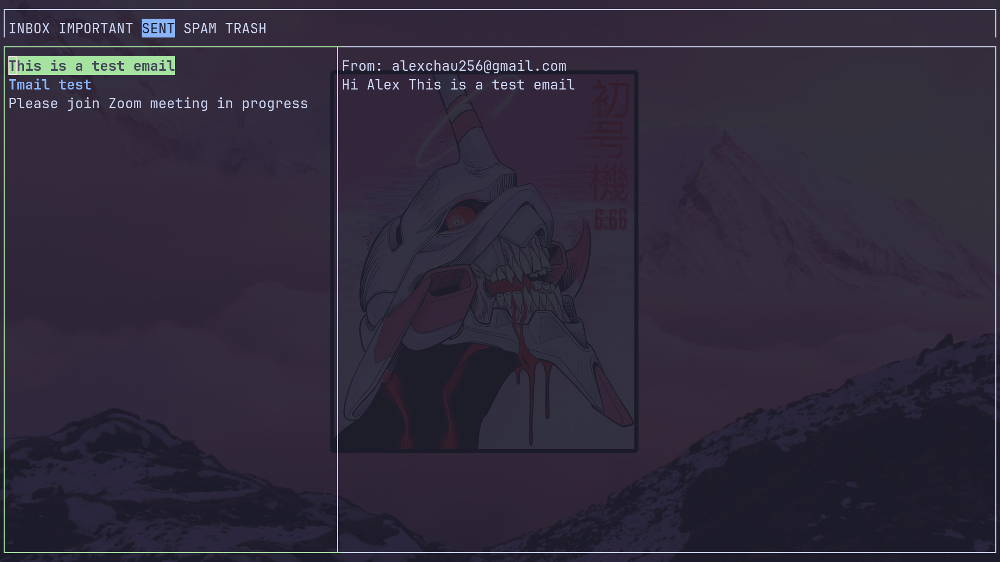
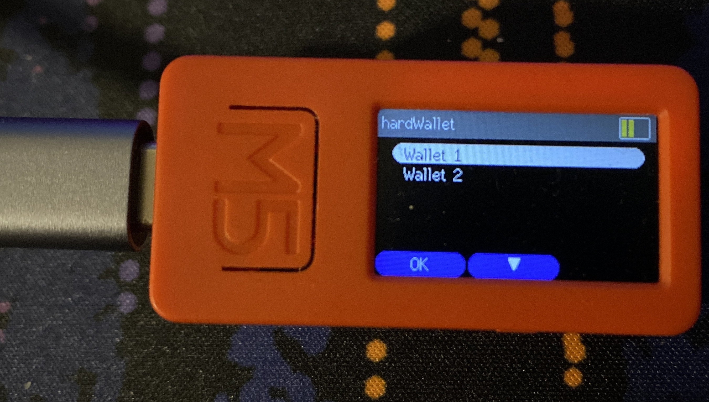
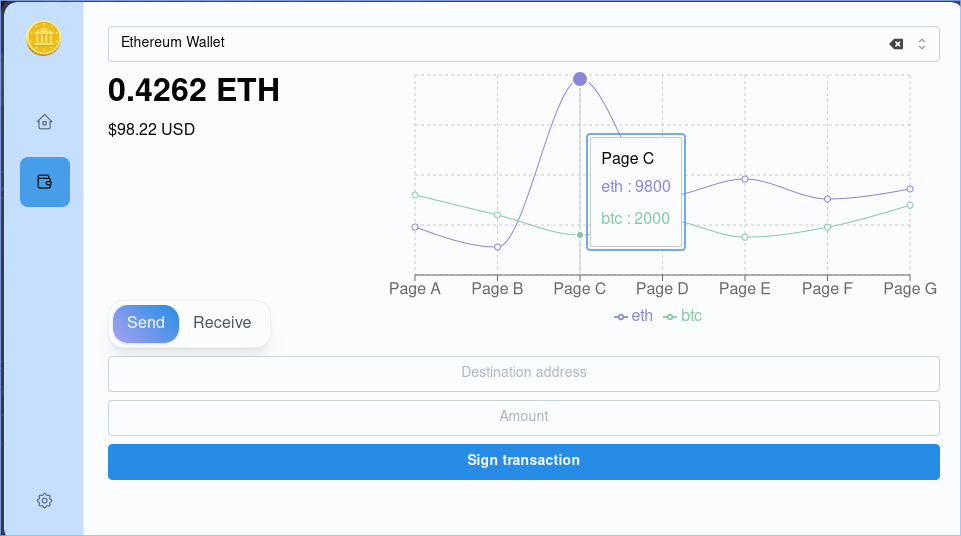

## Tmail — A gmail client for the terminal

A lightweight Gmail client for the terminal, written in Go. [GitHub ↗](https://github.com/AxterDoesCode/tmail)

Leveraged the Google Workspace Gmail API to execute a range of CRUD operations,
complementing this approach with a smart caching system designed to minimise the required number of asynchronous calls
(circumventing Google's rate limit under strenuous use).
For the terminal-based frontend I used [gocui](https://github.com/awesome-gocui/gocui).

## ColdWallet — An Ethereum hardware wallet

Built for my second-year software engineering project.

For the frontend we used Wails with JS/React, complemented by a Go backend. The hardware platform was the M5Stick (ESP32), with firmware in Arduino/C++.

The firmware served a dual purpose: generating a BIP39 seed phrase and creating multiple secure cryptocurrency wallets. Wallets were safeguarded with PIN security and recoverable from the seed phrase.

The desktop app provided checking current Ethereum prices, resetting wallets, and sending/receiving ETH transactions.
